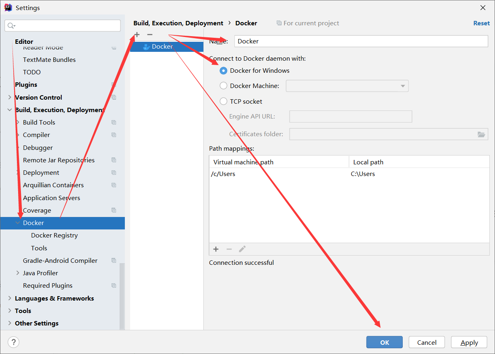
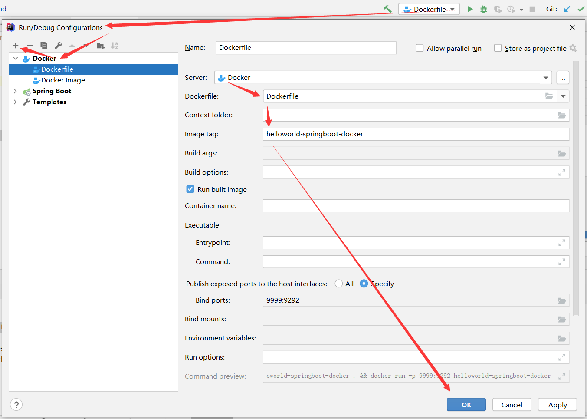

# helloworld springboot docker

> SpringBoot 部署到 docker 样例项目

## 一、下载并安装 docker

实验为win10系统，安装了 Docker Desktop for Windows  
版本号：Docker version 20.10.2, build 2291f61

## 二、准备好普通的 SpringBoot 项目

## 三、SpringBoot 项目执行 mvn clean package

注意：执行后检查该项目 target 目录下生成的 helloworld-springboot-docker-0.0.1-SNAPSHOT.jar 大小是否超过1MB大小，如果该jar太小表明打包异常。

## 四、SpringBoot 项目添加 Dockerfile 文件

注意：Dockerfile文件放到项目根目录

## 五、确定 IDEA 已经安装 docker 环境支持
我的 Intellij IDEA 版本号为 2020.3 (Ultimate Edition) 已经默认内置了 docker 插件  

## 六、IDEA 内添加 docker service 

## 七、IDEA 内部署 SpringBoot 到 docker

然后 run 这个刚刚新创建的 Dockerfile  
注意：图片内的 Bind ports 用以指定端口映射关系，本例是9999映射到该项目的9292，也就是需要访问 http://localhost:9999/hello?name=a 验证是否docker部署成功。